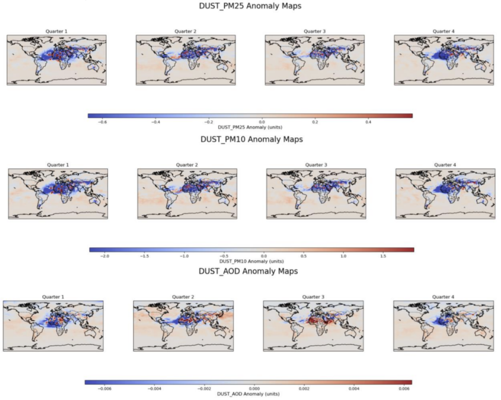

# The Relationship between Pollution and Economic Activity
**Sara Almadani**

## Introduction

In this study, I aim to replicate and extend the findings of Vandenbroucke and Zhu (2017) from their work *Measures of Pollution*. Their research explored the relationship between economic activity, measured by GDP per capita, and air pollution, specifically total PM2.5 and PM10. The study uses cross-country data from 1990 to 2014. Authors found both GDP and pollution (measured using CO2 emissions) increased over the time period. However, GDP per capita was increasing faster than CO2 emissions, suggesting that higher levels of pollution "is worth it" because the country’s economic output would be even greater.

My research project updates the data and uses better measures of pollution. Using an up-to-date dataset, I seek to examine whether the patterns observed in their study hold true with higher spatial and temporal resolution data. I will study the relationship between economic activity, measured by GDP per capita—a key indicator of average economic output per person—and the National Activity Index (CFNAI), a combination of 85 economic indicators assessing U.S. economic growth and inflationary pressure. It also analyzes air pollution levels generated from natural and anthropogenic sources.

### Research Question
**How does economic activity influence levels of air pollution?**

### Hypotheses
- **Null Hypothesis (H₀):** There is no significant relationship between economic activity and air pollution levels.
- **Alternative Hypothesis (Hₐ):** There is a significant relationship between economic activity and air pollution levels, indicating that changes in economic activities correspond to changes in pollution levels.

For this project, I focused on the USA because the country's economic structure and environmental policies provide a compelling context for such an analysis. The USA has a high GDP per capita, enabling significant investments in pollution control technologies, regulatory enforcement, and public health initiatives. By investigating this relationship, I aim to assess whether the USA's economic prosperity translates into lower air pollution levels, as suggested by the Environmental Kuznets Curve.

---

## Data

### Air Pollution Data
For this study, the ensemble mean is used to create a single dataset, combining the strengths of the individual models. The processed dataset spans from 2003 to 2022 with the following characteristics:
- **Spatial Resolution:** High resolution of 0.1° × 0.1°
- **Temporal Resolution:** Daily values

#### Variables of Interest
- **Dust PM2.5:** Fine particulate matter (<2.5 µm) from dust sources (e.g., deserts and arid regions)
- **Total PM2.5:** Total fine particulate matter (<2.5 µm) from all sources, including natural and anthropogenic sources
- **Dust PM10:** Coarse and fine dust particles (<10 µm) originating from natural dust sources, focusing on dust's role in visibility and atmospheric processes
- **Total PM10:** Total particulate matter (<10 µm) from all sources, including anthropogenic sources (e.g., construction and road dust), and natural sources
- **Dust Aerosol Optical Depth (AOD):** Measures dust particles' scattering and absorption of sunlight, reflecting their transport, climatic effects, and impact on air quality

### GDP per Capita Data
- **Source:** FRED, Federal Reserve Bank of St. Louis
- **Frequency:** Quarterly
- **Units:** Chained 2017 Dollars, Seasonally Adjusted Annual Rate

### Chicago Fed National Activity Index (CFNAI)
- **Source:** FRED, Federal Reserve Bank of St. Louis
- **Frequency:** Monthly, converted to quarterly

### Access and Data Paths
- **Dust Dataset Path:** `/groups/ESS3/sara/data/GlobDust/ensembled/daily`
- **GDP Dataset Path:** `/home/salmadan/GDPperCapita.csv`
- **CFNAI Dataset Path:** `/home/salmadan/CFNAI.csv`

---
## Methodology

### Mathematical Expression
The regression model used to analyze the relationship between economic activity and air pollution variables can be expressed as:

y_t = β_0 + β_1 x_t + ε_t

Where:
- **y_t**: Air pollution variables at time t
- **x_t**: First difference of GDP per capita (GDPt-1), serving as a measure of economic activity at time t
- **β_0**: Intercept, indicating the baseline value of the air pollution variables
- **β_1**: Slope coefficient, quantifying the change in the air pollution variables
- **ε_t**: Error term, capturing unexplained variability
This modeling approach draws inspiration from Vandenbroucke and Zhu (2017). While their study utilized **log-transformed** GDP per capita and total PM2.5 data to account for non-linear relationships and cross-country variability.  

### Table 1: Summary Statistics
Table 1 provides an overview of the summary statistics for the key variables analyzed in this study, including their means, standard deviations, and ranges, offering a snapshot of the underlying data distribution.

Figure 1 illustrates the time series of GDP per capita (left axis) and the National Activity Index (CFNAI, right axis), highlighting key economic trends and fluctuations. Both variables exhibit non-stationary behavior, with GDP showing a consistent upward trend over the years, punctuated by sharp declines during significant economic downturns, such as the 2008 global financial crisis and the COVID-19 pandemic in 2020. The CFNAI, while centered around zero, demonstrates substantial variability, reflecting fluctuations in economic activity. The apparent non-stationarity in both series, characterized by the lack of a constant mean or variance over time, underscores the importance of verifying stationarity before conducting further analyses.

Figure 2 presents the time series of Dust PM2.5, Dust PM10, total PM2.5, and total PM10 concentrations (primary axis) alongside Dust AOD (secondary axis). The variables exhibit clear seasonal cycles, likely driven by seasonal variations in dust activity. Dust AOD follows a similar seasonal trend, though at a smaller scale and captured on the secondary axis due to its lower magnitude.

---

## 5. Stationarity Testing

Formal statistical tests, such as the augmented Dickey–Fuller (ADF) test or autocorrelation function (ACF) analysis, should be applied to avoid spurious regressions. Therefore, the Augmented Dickey–Fuller (ADF) test was conducted to evaluate the stationarity of all variables.

### The formula for the ADF test is as follows:

Δy_t = α + γy_{t-1} + \sum_{i=1}^p β_i Δy_{t-1} + ε_t \tag{2}

### Where:
- **α**: The constant term, also known as the intercept.
- **yₜ₋₁**: The first difference of the time series \( yₜ \).
- **γyₜ₋₁**: Lagged level of the series, where \( γ \) is the coefficient being tested for stationarity.
- **∑ᵢ₌₁ᵖ βᵢ Δyₜ₋₁**: Lagged differences of \( yₜ \) to account for higher-order autocorrelation.
- **p**: The number of lagged terms included in the model, often selected using criteria such as AIC or BIC.
- **εₜ**: White noise error term.
- **H₀: γ = 0** vs. **H₁: γ < 0**, with **H₀** indicating nonstationarity.

---

The ADF test for **GDP per capita** yielded a high p-value, indicating that the null hypothesis of **non-stationarity** cannot be rejected, confirming that the series is non-stationary. For the **National Activity Index**, the test showed an ADF statistic of -4.78 and a p-value below 0.05, leading to the rejection of the null hypothesis and confirming that the index series is **stationary**.

Similarly:
- **Dust PM2.5**, **Dust PM10**, and **total PM2.5** were also found to be **stationary**, with their null hypotheses rejected at the 5% significance level.
- However, **Dust AOD** and **total PM10** are **non-stationary**, as their p-values exceed 0.05, indicating the null hypothesis cannot be rejected.

These results highlight that while stationary variables can be used directly in time series modeling, non-stationary variables require transformations like differencing or detrending to ensure reliable statistical analysis.
---

# Results

The results of this study provide an explanation of the relationships between economic activity and air pollution indicators. The findings are organized into six key sub-sections:

1. **Regression Analysis of GDP per Capita and Air Pollution Variables.**
2. **Concentration Maps of Air Pollution Variables for 2022.**
3. **Anomaly Analysis.**
4. **Description of Composite Anomalies for High, Low, and Moderate Phases.**
5. **Differences in Composite Anomalies of Air Pollution Variables Across National Activity Index (CFNAI) Phases.**
6. **Regression Map: Total PM2.5 Anomalies vs. National Activity Index.**
### 1. Regression Analysis of GDP per Capita and Air Pollution Variables

Regression analyses show statistically significant relationships between changes in GDP per capita and air pollution variables, such as total PM2.5 and total PM10 concentrations, with the exception of dust AOD, which showed no significant association.

---

#### Dust PM2.5
The regression analysis for quarterly dust PM2.5 concentrations against GDP per capita shows a statistically significant relationship, with a p-value of 0.030 for the coefficient of GDPt-1. This indicates that GDP per capita differences have a positive but modest effect on dust PM2.5 levels. However, the R² suggests that GDPt-1 explains only 6.2% of the variance in dust PM2.5 concentrations, highlighting that other factors not included in the model likely contribute significantly to PM2.5 levels. The constant term is also highly significant (p-value < 0.001), with a value of 2.6578, while the Durbin-Watson statistic of 1.861 suggests minimal autocorrelation in the residuals, supporting the reliability of the model's assumptions.

---

#### Dust PM10
The regression analysis for dust PM10 concentrations against GDP per capita indicates a statistically significant relationship, with a p-value of 0.036 for the coefficient of GDPt-1. This suggests that GDP per capita differences have a small but statistically significant positive effect on dust PM10 levels. However, the R² implies that GDPt-1 explains only 5.8% of the variance in dust PM10. The constant term is highly significant (p-value < 0.001), with a value of 9.5291. The Durbin-Watson statistic of 1.827 indicates minimal autocorrelation in the residuals, supporting the reliability of the regression model's assumptions.

---

#### Dust Aerosol Optical Depth (AOD)
The regression analysis for dust AOD against GDP per capita shows no statistically significant relationship, as the p-value for the coefficient of GDPt-1 is 0.695. The R² indicates that GDPt-1 explains just 0.2% of the variance in dust AOD, and the adjusted R² is negative, suggesting that the model does not provide a meaningful explanation for the variation in the dependent variable. The constant term is significant (p-value < 0.001), with a value of 0.0184. The Durbin-Watson statistic of 1.639 suggests low autocorrelation in the residuals, but the overall model fails to identify any substantial relationship between GDPt-1 and dust AOD.

---

#### Total PM2.5
The regression analysis for PM2.5 against GDP per capita indicates a statistically significant positive relationship, with a p-value of 0.021 for the coefficient of GDPt-1. The R² suggests that GDPt-1 explains 7.0% of the variance in PM2.5 concentrations, indicating a modest explanatory power for the model. The constant term is highly significant (p-value < 0.001), with a value of 8.9984. The Durbin-Watson statistic of 2.112 suggests minimal autocorrelation in the residuals, further supporting the reliability of the model. Overall, while GDPt-1 exhibits a significant association with PM2.5 levels, the relatively low R² value suggests that additional variables likely contribute to PM2.5 variability.

---

#### Total PM10
The regression analysis for PM10 concentrations against GDP per capita shows a statistically significant positive relationship, with a p-value of 0.033 for the coefficient of GDPt-1. This suggests that GDP per capita has a small but significant effect on PM10 concentrations. The R² indicates that GDPt-1 explains 6.0% of the variance in PM10. The constant term is highly significant (p-value < 0.001), with a value of 24.9701. The Durbin-Watson statistic of 1.750 suggests low autocorrelation in the residuals, supporting the validity of the regression model's assumptions.

### 2. Concentration Maps of Air Pollution Variables for 2022

The concentration maps present the spatial distribution of air pollution variables across the four quarters of 2022, the final year in the dataset. 

Within the USA, dust variables show relatively low concentrations compared to global hotspots like northern Africa and the Middle East. The highest dust levels in the USA are observed in the southwestern states, attributed to localized natural dust sources. These concentrations remain fairly consistent across quarters, reflecting the limited impact of seasonal variations on dust emissions in the USA.

In contrast, total pollution variables exhibit more spatial variability, with elevated levels in urban and industrialized regions, particularly in the Midwest and along the East Coast. Seasonal trends suggest higher total PM2.5 concentrations during the colder months, likely driven by residential heating, while total PM10 levels peak slightly during the spring and summer, possibly influenced by increased dust activity and other atmospheric conditions.

---

### 3. Anomaly Analysis

The anomaly maps illustrate quarterly deviations from long-term averages, showing significant spatial and temporal variations in air pollution. 

- **In the USA**:
  - Positive anomalies in **dust PM2.5** and **dust PM10** are observed in the southwestern and western regions during dry seasons (Quarters 2 and 3).
  - Negative anomalies dominate the eastern USA during wetter seasons (Quarters 1 and 4).

- **Globally**:
  - Notable positive anomalies align with major natural dust sources, such as the Sahara Desert and the Middle East.
  - **Dust AOD anomalies** highlight the contribution of arid regions to atmospheric optical depth, with the USA showing generally neutral anomalies.

- **Total PM2.5 and Total PM10**:
  - Positive anomalies occur in urban and industrialized regions during winter.
  - Negative anomalies are observed in the western USA during summer.

These patterns highlight the interplay of emissions, meteorological conditions, and regional characteristics in shaping air quality, providing insights for public health and environmental policies.

---

### 4. Description of Composite Anomalies for High, Low, and Moderate Phases

The figures below show the classification of the National Activity Index (CFNAI) into high, low, and neutral (or moderate) categories across the dataset's timeline. These classifications provide a visualization of economic activity fluctuations and their alignment with significant events, such as recessions or economic booms.

During the **High phase**, robust economic activity corresponds with positive anomalies in dust-related concentrations over arid regions like Northern Africa, the Middle East, and South Asia, as well as anthropogenic pollution hotspots in eastern Asia.  
In contrast, the **Low phase** shows negative anomalies, reflecting reduced emissions and improved air quality in dust-prone and industrial regions.  
The **Moderate phase** displays weaker and more diffuse anomalies, indicating a lesser impact of intermediate economic activity.

---

### 5. Differences in Composite Anomalies of Air Pollution Variables Across National Activity Index (CFNAI) Phases

The maps show composite differences in air pollution anomalies between different CFNAI phases (**High-Moderate** and **Low-Moderate**). 

- **High Phases vs. Moderate Phases**: Significant positive anomalies are observed, particularly over regions with high dust activity, such as the Middle East and parts of the USA.
- **Low Phases vs. Moderate Phases**: Negative anomalies are evident over the USA, emphasizing reduced concentrations during periods of lower economic activity.
- **Dust AOD Anomalies**: Show minimal variations across the phases, suggesting that the optical depth of dust aerosols is less sensitive to economic fluctuations.

---

### 6. Regression Map: Total PM2.5 Anomalies vs. National Activity Index

The regression map illustrates the relationship between PM2.5 anomalies and the National Activity Index, focusing on total PM2.5, which includes both anthropogenic pollutant sources, such as industrial and vehicular emissions, and natural sources, such as dust and wildfire smoke. 

- **Color Gradients**: 
  - **Red Areas**: Show a positive relationship (higher PM2.5 levels with increased economic activity).
  - **Blue Areas**: Indicate a negative relationship (lower PM2.5 levels with increased economic activity).
- **Statistically Significant Regions**: Marked with "/", highlighting areas where the relationship between PM2.5 and economic activity is robust.

Within the USA, regions with positive regression coefficients underscore the impact of industrial and urban emissions, while negative coefficients may reflect successful emission reduction measures or shifts toward cleaner economic activities.

#### Outside the USA:
The Middle East presents a surprising inverse relationship (negative coefficients), which can be attributed to:
1. **Reliance on Oil Production**: Economic activity primarily driven by oil production and export may not directly increase localized air pollution in the same way as industrial activity or urbanization.
2. **Investments in Emission Controls**: Advanced technologies may mitigate urban PM2.5 levels.
3. **Natural PM2.5 Sources**: A significant portion of PM2.5 in the Middle East originates from natural sources, reducing the role of anthropogenic emissions.

This combination of factors weakens or even inverts the relationship between economic activity and PM2.5 concentrations.

---
## Discussion and Conclusions

This study examines the relationships between economic activity and air pollution indicators, with a focus on the United States. By analyzing regression models, spatial concentration patterns, anomaly trends, and composite maps across varying economic phases, the findings reveal statistically significant associations between GDP per capita changes and particulate matter concentrations.

The regression map provides additional insights, particularly in the United States, where industrialized and urban regions exhibit stronger positive relationships with economic activity. These findings enable us to reject the null hypothesis (**H₀**), confirming that there is a significant relationship between economic activity and air pollution levels. In doing so, this study answers the research question: **How does economic activity influence levels of air pollution?** The evidence demonstrates that changes in economic activities are closely linked to variations in air pollution, with intensified economic activity corresponding to higher levels of particulate matter.

Despite its contributions, this study has notable limitations:
1. **Missing Daily NetCDF Files**: A key limitation is the presence of 20 missing files out of the expected total, which could impact the accuracy of computed quarterly averages and bias results, especially if the missing data corresponds to periods with atypical dust levels.
2. **Potential Underestimation**: For instance, the absence of data from high-dust events could underestimate the relationship between economic activity and dust-related air pollution indicators.
3. **Reduced Statistical Power**: The reduced dataset may weaken the statistical power of the regression analysis, leading to lower R² values and less precise p-values.

While resampling techniques were employed to mitigate these effects, the potential for unmeasured biases remains a consideration when interpreting the findings.

In conclusion, this study highlights the modest and regionally variable impacts of economic activity on air pollution, emphasizing the interplay between anthropogenic emissions and natural factors. While the focus on the United States provides useful insights into the role of economic structure and environmental policy, the study's limitations point to the need for future research using more complete datasets.

---

## References

1. World Health Organization (WHO). (2018). *Air pollution and health*. Retrieved from [https://www.who.int](https://www.who.int)
2. Vandenbroucke, G., & Zhu, H. (2017). *Measures of Pollution*. Economic Synopses, (2017, No. 9). Federal Reserve Bank of St. Louis. Retrieved from [https://fraser.stlouisfed.org/title/economic-synopses-6715/measures-pollution-624497](https://fraser.stlouisfed.org/title/economic-synopses-6715/measures-pollution-624497)
3. Enders, W. (2014). *Applied Econometric Time Series* (4th ed.). Wiley.
4. U.S. Bureau of Economic Analysis, Real gross domestic product per capita [A939RX0Q048SBEA], retrieved from FRED, Federal Reserve Bank of St. Louis; [https://fred.stlouisfed.org/series/A939RX0Q048SBEA](https://fred.stlouisfed.org/series/A939RX0Q048SBEA), November 18, 2024.
5. Federal Reserve Bank of Chicago, Chicago Fed National Activity Index [CFNAI], retrieved from FRED, Federal Reserve Bank of St. Louis; [https://fred.stlouisfed.org/series/CFNAI](https://fred.stlouisfed.org/series/CFNAI), November 27, 2024.

---

## Appendix A

Vandenbroucke and Zhu (2017) employed logarithmic transformations of GDP per capita and Total PM2.5 emissions in their analysis, as illustrated in the figure below. The use of log serves two main purposes:
1. **Linearization**: Helps linearize potentially nonlinear relationships, making regression models more interpretable and suitable for statistical analysis.
2. **Mitigation of Outliers**: Reduces the influence of outlier observations.

Following this methodology, I applied logarithmic transformations to the non-stationary variables, followed by computing their first differences to address stationarity issues and prepare the data for further analysis.

The regression results (see below) for the log-transformed variables indicate very low R² values across all models, suggesting that the independent variable (Log GDPt-1) explains only a minimal portion of the variability in the dependent variables. Additionally, the p-values for the coefficients of Log GDPt-1 are consistently above the significance level of 0.05. 

Upon further review of the methodology employed by Vandenbroucke and Zhu (2017), it appeared that their analysis involved cross-country panel data, which inherently introduces greater variability and allows for the exploration of broader patterns across different economies. This justifies their use of logarithmic transformations, as panel data often encompass a wide range of GDP values and total PM2.5 emissions spanning multiple orders of magnitude. 

By contrast, my analysis focuses on data from the United States, where GDP per capita and pollution variables likely exhibit less variability, reducing the necessity for log transformations. To test this hypothesis, I re-ran the regressions without log transformations (see Results section).

---

#### Total PM10:

